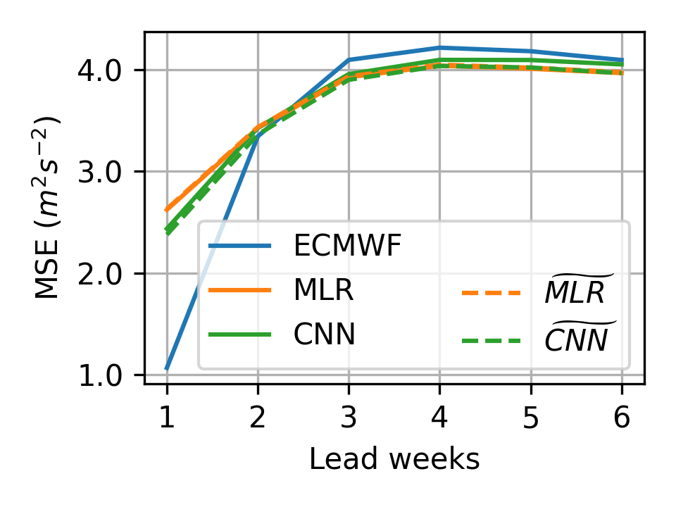
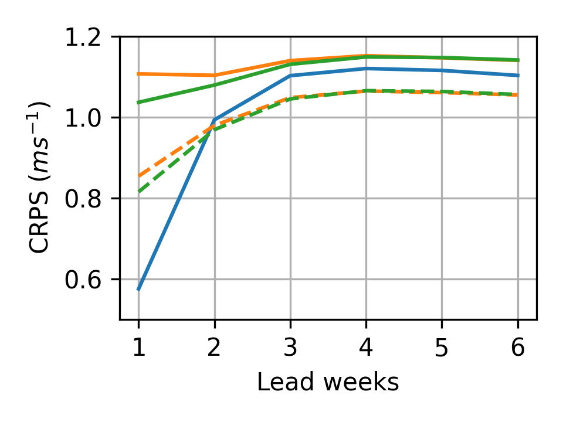
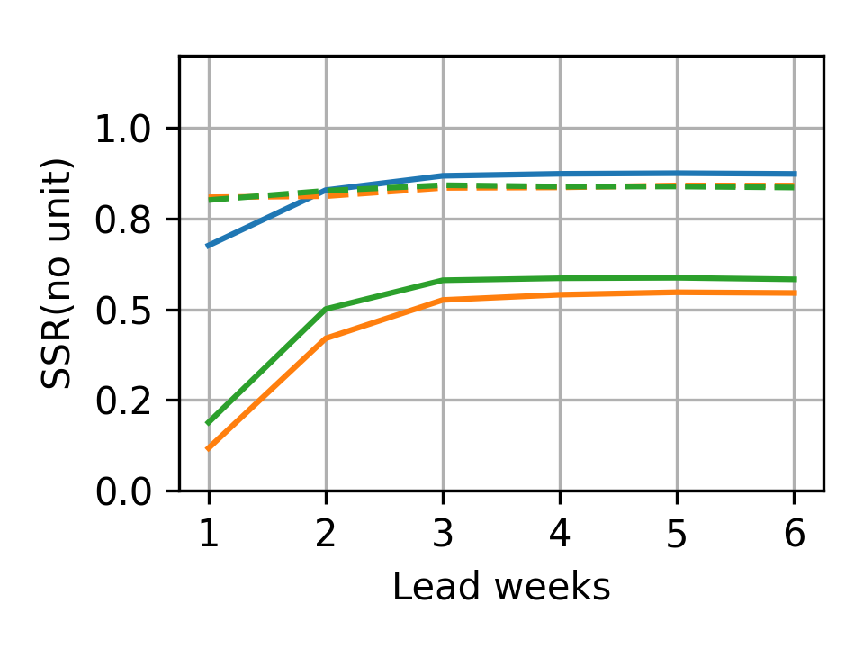
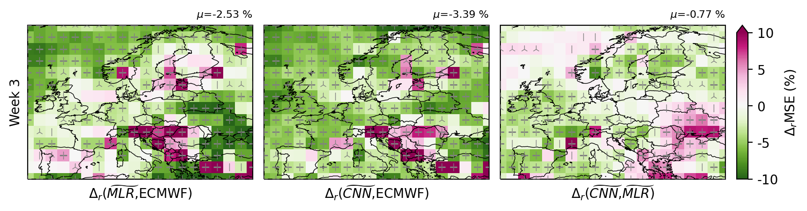
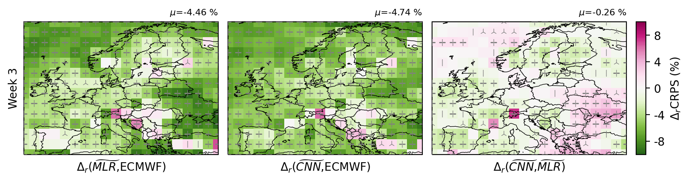

# Statistical Downscaling for Sub-seasonal Wind Speed Prediction
[](https://arxiv.org/abs/2411.19077)
[](https://opensource.org/licenses/MIT)

This repository contains the official implementation of our paper "Improving sub-seasonal wind-speed forecasts in Europe with a non-linear model". This Work has been submitted to Monthly Weather Review. Copyright in this Work may be transferred without further notice.

## Data Availability Notice
While our research paper uses 100m wind speed data from ECMWF extended-range hindcasts (requiring institutional license), this repository provides example implementation using 100m wind speed data interpolated from 10m wind speed using the power law profile equation for demonstration purposes. This approach follows the 100m wind speed derivation method described in [1]. This allows users to test and understand the methodology while adhering to data licensing restrictions.

[1] Cozian, Bastien, Corentin Herbert, and Freddy Bouchet. "Assessing the probability of extremely low wind energy production in Europe at sub-seasonal to seasonal time scales." Environmental Research Letters 19.4 (2024): 044046.

### Research Data Sources
- ERA5 reanalysis data: Available from the [Climate Data Store](https://cds.climate.copernicus.eu)
- ECMWF extended-range forecasts and hindcasts: Available through Meteorological Archival and Retrieval System (requires institutional license)
- S2S project data: Researchers interested in sub-seasonal forecasts and hindcasts can access related datasets through the [ECMWF S2S project](https://www.ecmwf.int/en/research/projects/s2s)

## Overview
This project implements statistical downscaling methods to improve sub-seasonal wind speed predictions by:
1. Training regression models (MLR and CNN) on reanalysis data to map from 500hPa geopotential height to wind speed
2. Applying trained models to ECMWF extended range forecasts
3. Implementing stochastic perturbation to improve ensemble spread

## Requirements
We recommend using conda to create a new environment and install the required packages. Follow these steps to set up the environment:

```bash
# Create a new environment with Python 3.9
conda create -n nonlinear python=3.9 -y
conda activate nonlinear

conda install numpy=1.20.3 -c conda-forge -y

conda install pytorch::pytorch torchvision torchaudio -c pytorch -y
conda install pytorch-lightning=2.0.9 -c conda-forge -y
pip install "pytorch-lightning[extra]"

conda install optuna=3.3.0 -c conda-forge -y
conda install optuna-integration -c conda-forge -y
conda install scikit-learn=0.24.2 -y

conda install xarray=2022.3.0 -c conda-forge -y
conda install -c conda-forge netcdf4 h5netcdf -y
conda install pandas -y
conda install cartopy -y
pip install cfgrib 
pip install ecmwf-api-client
pip install cdsapi
pip install pymp-pypi
pip install -U rich
pip install -e .
```

## Model Architecture
The repository includes implementations of:
- Multiple Linear Regression (MLR)
- Convolutional Neural Network (CNN)
- Stochastic versions of both models

## Usage
### 10m Wind Speed and Z500 Data Download
Please refer to https://cds.climate.copernicus.eu/how-to-api to configure cdsapi

Please refer to https://pypi.org/project/ecmwf-api-client/ to configure ecmwfapi

ERA5 reanalysis data download:
```bash
python src/downscaling/data/downloader_reanalysis.py
```

S2S ensemble forecast data download:
```bash
python src/downscaling/data/downloader_ensembles.py
```

### Data Preprocessing and Wind Speed Interpolation
```bash
python src/downscaling/data/processing.py
```

Processed data should be organized as:
```
data
├── processed
│   ├── fcasts
│   │   ├── calib
│   │   └── raw
│   ├── hcasts
│   │   ├── calib
│   │   └── raw
│   └── reanalysis
└── raw
    ├── fcasts
    ├── hcasts
    └── reanalysis
```
### Training and Inference
```bash
# Train MLR model
python src/scripts/template_main.py --trainingModels MLR

# Train CNN model 
python src/scripts/template_main.py --trainingModels CNN
```

### Evaluation
```bash
# Calculate verification metrics
python src/scripts/evaluation/evalute.py
```

### Visualization 
Please refer to visualization.ipynb

## Results
⚠️ **Important Note**: The results presented here are based on 100-meter wind speed interpolated from 10-meter wind speed data, and therefore differ from the actual results shown in the published paper. 
<!-- These interpolated results are provided for demonstration purposes only and should not be used for direct comparison with the paper's findings. -->

### Spatial averaged MSE, CRPS and SSR as a function of lead time

<div style="display: flex; justify-content: space-between;">
  
  
  
</div>
<p align="center"><i>The spatial mean of MSE, CRPS and SSR as a function of lead week across the Europe domain for U100 hindcasts from the ECMWF, the MLR, the CNN, the stochastic MLR and the stochastic CNN.</i></p>

### Relative improvements of MSE and CRPS at Week 3

<div style="display: flex; flex-direction: column; align-items: center;">
  <div style="margin-bottom: 20px;">
    
  </div>
  <div>
    
  </div>
</div>
<p align="center"><i>Δ<sub>r</sub> MSE (top) and Δ<sub>r</sub> CRPS (bottom) at lead week 3 comparing the improvements in the MLR over the ECMWF, the CNN over the ECMWF, and the CNN over the MLR. Δ<sub>r</sub> MSE(model,bench) denotes the difference between the MSE of model and the MSE of benchmark over the MSE of the latter. Thus, negative (positive) values correspond to improved (worsened) skill. To assess the robustness of Δ<sub>r</sub> MSE, gray scatter points marked with "+" on the grid points denote statistically significant (0.01 significant level) improvements or degradations at those grid points. The spatial mean μ of the score and the Δ score are provided at the top of each subfigure.</i></p>


## Citation
If you find this code useful in your research, please consider citing:
```bibtex
@article{tian2024improving,
  title={Improving sub-seasonal wind-speed forecasts in Europe with a non-linear model},
  author={Tian, Ganglin and Coz, Camille Le and Charantonis, Anastase Alexandre and Tantet, Alexis and Goutham, Naveen and Plougonven, Riwal},
  journal={arXiv preprint arXiv:2411.19077},
  year={2024}
}
```

## License
This project is licensed under the MIT License - see the [LICENSE](LICENSE) file for details.